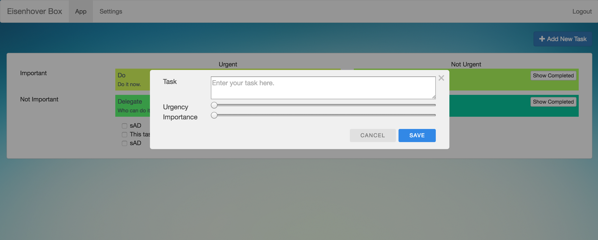

# Eisenhower Box
This is a sample todo app that sorts/places tasks on a Eisenhower Matrix.

I've implemented this project in order to learn Play Framework and Angular.

## Eisenhower Matrix
Eisenhower matrix is a flow for self time management.You simply grade your tasks whether they are important and urgent. This is a simple

See wiki entry for [wiki:Eisenhower Matrix](https://en.wikipedia.org/wiki/Time_management#The_Eisenhower_Method).

## Prerequisites
- node
- npm

(activator should take care of rest)

## Running the app
Pull files from git and then call:

> npm install

To Start the server:
> activator run

This will actually trigger a **npm** build action and start the local **dynamodb** instance.

Username: admin@admin.com

Password: admin

You can also find a register link on the login page to create more users. There is nothing special about the admin user.
It's only initial user the system automatically creates.

### Resources

- https://github.com/akka/akka/tree/master/akka-samples

- https://www.lightbend.com/activator/templates#filter:java8

- playframework official site

- https://docs.angularjs.org

### Note to self
- Check how to Dev and Prod builds separately both on BE/FE, so that i may omit some debug code.
- Check Akka remoting and clustering
- Check out Akka supervision
- Add Testing
- DynamoDB must Manually be started when testing with activator as Playhooks don't work on test
- Akka actors cannot pass back **null** values. Instead i returned dummy objects and had to validate on client. Is there a more appropriate way to do this.

### Captains Log
- Create project using activator
- Created a webpack setup in npm with Babel ES6 support (outputs 3 files app.js, vendor.js, style.css), didn't actually go into less/sass yet only plain css (see: webpack.config.js)
- Attached npm scripts to play hooks in order to build and watch for changes (hot-loading)
- Started with directives for matrix
- Figured out how to do scoped styling and templating for directives. 
- Added bootstrap as external dep.
- Finished Matrix directive
- Played with scopes for a bit, figured out how to pass data/functions to directives.
- Generalized directive creation
- Started playing with Play Controllers
- Configured IntelliJ to Debug Play framework
- Started to look at akka for non-blocking functionalities
- Created model class for Task
- Created Task Actors for persistance
- Created task DAO for easy access to task actors
- checked how to do callbacks in controllers (java8 rocks!) Figured out how to use CompletableFuture/CompletionStage classes.
- started to look at DynamoDB for persistant storage
- checked how to create and use Java annotations (syntax has changed since i last used java)
- Started to implement annotations to support dynamodb, although later on found out that aws sdk has already implemented annotations and mappers for dynamodb, so removed my implementations.
- Install and attach DynamoDB to Playhooks
- Configured .gitignore
- Implement DynamoDB on actors
- Add service to angular to do task operations
- Add status to task (BE and FE)
- Angular routing to add a settings screen
- Implemented service and model for User
- User Authentication to Play, uses sessions.
- Play Twirl templating for login and register pages
- Added hashing for password

### Screenshots

